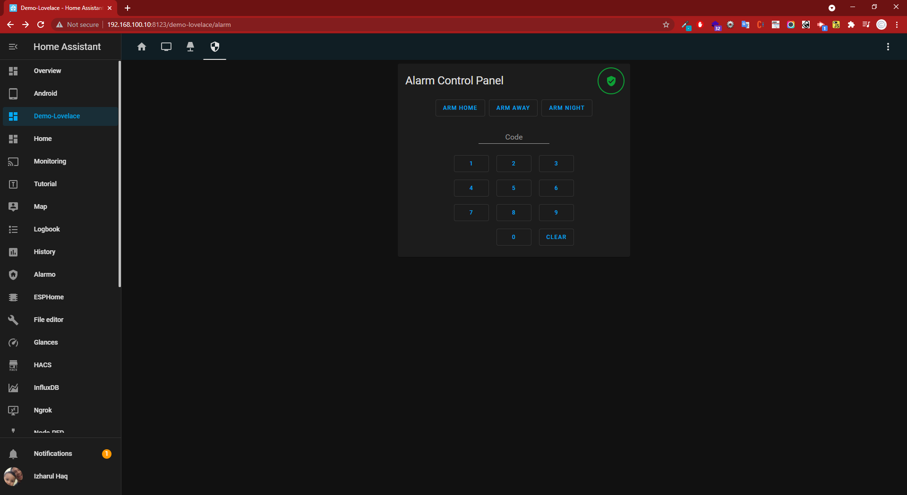

# Membuat Panel Alarm secara Manual



[toc]

## 01. Pendahuluan

Pada tutorial kali ini saya akan membahas tentang bagaimana cara membuat **Panel Alarm** secara manual, yang fungsinya untuk menjembatani sensor-sensor yang kita miliki agar dalam saling bersinergi dalam menjaga rumah kita baik di saat berada di rumah, malam hari maupun saat berada di luar rumah.

## 02. Skenario

Disini saya ingin agar alarm berbunyi saat sensor gerak mendeteksi adanya pergerakan di depan pintu kamar baik saat saya berada dirumah, luar rumah maupun di malam hari. Bukan hanya itu saja, saya juga akan mendapatkan notifasi berupa pemberitahuan adanya gerakan di depan pintu kamar melalui smartphone yang saya gunakan.

Sebelum alarm berbunyi, volume speaker akan di set agar lebih tinggi dari kondisi normal kemudian mengeluarkan suara pemberitahuan kepada penyusup, dan tidak lama kemudian speaker pun memutar file mp3 yang sudah disimpan di perangkat yang menjalankan **Home Assistant**.

## 04. Persiapan

Berikut daftar perangkat yang kita butuhkan untuk menjalankan skenario ini:

- Motion Sensor
- Google Nest Mini
- Smart Bulb/Smart Wall Switch

Siapkan juga file mp3 yang anda inginkan dan simpan di STB dengan bantuan addon **SAMBA** pada folder **/config/www/local/mp3**.

## 05. Integrasi

Tambahkan baris berikut pada file **configuration.yaml** menggunakan **File editor** :

```yaml
alarm_control_panel:
  - platform: manual
    code: !secret alarm_code
    arming_time: 30
    delay_time: 20
    trigger_time: 4
    disarmed:
      trigger_time: 0
    armed_home:
      arming_time: 0
      delay_time: 0
    code_arm_required: false
```
Berikutnya tambahkan baris berikut pada file **secrets.yaml** :

```yaml
# Alarm Control Panel
alarm_code: 1234	# Silahkan ganti dengan kode yang anda inginkan
```
Berikutnya ke menu **Configuration** > **Server Controls** pada kolom **Configuration validation** klik **CHECK CONFIGURATION** dan pastikan tidak ada galat yang muncul. Lanjutkan dengan klik **RESTART** pada kolom **Server management**, silahkan tunggu hingga prosesnya selesai.

## 06. Konfigurasi

Agar skenario yang kita inginkan dapat bekerja dengan baik, maka kita perlu membuat beberapa *skrip* di menu **Configuration** > **Scripts**, untuk membuat *skrip* ini silahkan klik tombol **ADD SCRIPT** yang berada pada kanan bawah halaman.

Setelah halaman membuat *skrip* terbuka, klik menu pada kanan atas halaman dan pilih **Edit in YAML** maka kita akan di hadapkan dengan halaman **New Script**, kosongkan halaman editornya dan isi dengan kode berikut:

Mode berada di rumah:

```yaml
alias: 'Alarm: Arm Stay'
sequence:
  - service: alarm_control_panel.alarm_disarm
    target:
      entity_id: alarm_control_panel.ha_alarm
    data:
      code: '1234'
mode: single
icon: mdi:human
```
kemudian klik **SAVE SCRIPT** yang berada pada kanan bawah halaman. Lakukan langkah yang sama untuk membuat mode lainnya.

Mode di luar rumah:

```yaml
alias: 'Alarm: Arm Away'
sequence:
  - service: alarm_control_panel.alarm_arm_away
    target:
      entity_id: alarm_control_panel.ha_alarm
    data:
      code: '1234'
mode: single
icon: mdi:car
```

Mode berada di rumah pada malam hari:

```yaml
sequence:
  - service: alarm_control_panel.alarm_arm_night
    target:
      entity_id: alarm_control_panel.ha_alarm
    data:
      code: '1234'
mode: single
alias: 'Alarm: Arm Night'
icon: mdi:star
```

Membuat *scene* untuk menyalakan lampu:

```yaml
- id: '1624041309545'
  name: 'Alarm: Turn lights on'
  entities:
    light.lampu_kamar_pv:
      min_mireds: 154
      max_mireds: 370
      effect_list:
      - Night
      - Read
      - Meeting
      - Leasure
      - Soft
      - Rainbow
      - Shine
      - Beautiful
      supported_color_modes:
      - color_temp
      - hs
      color_mode: color_temp
      brightness: 255
      color_temp: 154
      friendly_name: Lampu Kamar PV
      supported_features: 23
      state: 'on'
    light.301006345002910a158b:
      min_mireds: 153
      max_mireds: 370
      supported_color_modes:
      - color_temp
      color_mode: color_temp
      brightness: 255
      color_temp: 56
      friendly_name: Lampu Kamar
      supported_features: 3
      state: 'on'
  icon: mdi:alarm-light-outline
```

Membuat *scene* untuk mematikan lampu:

```yaml
- id: '1624041328549'
  name: 'Alarm: Turn lights off'
  entities:
    light.lampu_kamar_pv:
      min_mireds: 154
      max_mireds: 370
      effect_list:
      - Night
      - Read
      - Meeting
      - Leasure
      - Soft
      - Rainbow
      - Shine
      - Beautiful
      supported_color_modes:
      - color_temp
      - hs
      friendly_name: Lampu Kamar PV
      supported_features: 23
      state: 'off'
    light.301006345002910a158b:
      min_mireds: 153
      max_mireds: 370
      supported_color_modes:
      - color_temp
      friendly_name: Lampu Kamar
      supported_features: 3
      state: 'off'
  icon: mdi:alarm-light-off-outline
```

Lanjutkan dengan membuat *skrip* untuk mengedipkan lampu:

```yaml
alias: 'Alarm: Flash Lights (ON)'
sequence:
  - condition: state
    entity_id: alarm_control_panel.ha_alarm
    state: armed_away,armed_home,armed_night
  - service: scene.turn_on
    target:
      entity_id: scene.alarm_turn_red   # Sesuaikan dengan Entity ID yang Anda miliki
  - delay:
      hours: 0
      minutes: 0
      seconds: 2
      milliseconds: 0
  - service: scene.turn_on
    target:
      entity_id: scene.alarm_turn_lights_off    # Sesuaikan dengan Entity ID yang Anda miliki
  - service: script.turn_on
    target:
      entity_id:
        - script.alarm_flash_loop_on    # Sesuaikan dengan Entity ID yang Anda miliki
mode: single
icon: mdi:alarm-light-outline
```

Kemudian membuat *skrip* pengulangan:

```yaml
alias: '  Alarm: Flash Loop (ON)'
sequence:
  - delay:
      hours: 0
      minutes: 0
      seconds: 2
      milliseconds: 0
  - service: script.turn_on
    target:
      entity_id:
        - script.1624058695419    # Sesuaikan dengan Entity ID yang Anda miliki
mode: single
icon: mdi:alarm-light
```
------

**Catatan:**

------
> **script.1624058695419** adalah entity id dari *script* **Alarm: Flash Lights (ON)** yang telah kita buat sebelumnya, silahkan periksa entity id yang anda miliki dengan mengakses menu **Configuration** > **Entities**, pada kolom *Pencarian* isikan dengan **Alarm: Flash Lights (ON)** maka akan muncul entity id-nya.
------

Setelah *skrip* selesai dibuat, maka kita lanjutkan dengan membuat *automasi* sesuai dengan skenario yang telah dibahas di awal artikel ini. Masih di menu **Configuration** pilih menu **Automations**, kemudian klik **ADD AUTOMATION** yang berada di kanan bawah halaman, pilih **START WITH AN EMPTY AUTOMATION**.

Setelah halaman membuat *automasi* terbuka, klik menu pada kanan atas halaman dan pilih **Edit in YAML** maka kita akan di hadapkan dengan halaman **New Automation**, kosongkan halaman editornya dan isi dengan kode berikut:

```yaml
alias: 'Alarm: Trigger when armed and motion detection (Arm Away)'
description: ''
trigger:
  - type: motion
    platform: device
    device_id: b138483760ff53724bdd30d16c4e521a
    entity_id: binary_sensor.motion_sensor
    domain: binary_sensor
condition:
  - condition: state
    state: armed_away,armed_home,armed_night
    entity_id: alarm_control_panel.ha_alarm
action:
  - service: notify.mobile_app_redmi_note_9_pro
    data:
      message: Motion detected at home!
      title: INTRUDER ALERT!
  - service: media_player.volume_set
    target:
      entity_id: media_player.google_home
    data:
      volume_level: 0.2
  - service: tts.google_translate_say
    data:
      entity_id: media_player.google_home
      message: >-
        Intruder detected! You are captured on camera and the police is
        notified!
      language: id
  - delay:
      hours: 0
      minutes: 0
      seconds: 10
      milliseconds: 0
  - service: media_player.play_media
    target:
      entity_id: media_player.google_home
    data:
      media_content_id: http://192.168.100.10:8123/local/mp3/siren.mp3
      media_content_type: music
  - service: script.turn_on
    target:
      entity_id: script.1624058695419
mode: single
```
kemudian klik **SAVE ** yang berada pada kanan bawah halaman editornya.

Agar suara alarm tidak terus menerus berbunyi, maka kita perlu mambuat *automasi* supaya suara alarm berhenti saat kita memilih mode **disarm**.  isi dengan kode berikut:

```yaml
alias: 'Alarm: Stop sound on disarm'
description: ''
trigger:
  - platform: state
    entity_id: alarm_control_panel.ha_alarm
    from: armed_away
    to: disarmed
condition: []
action:
  - service: media_player.turn_off
    target:
      entity_id: media_player.google_home
mode: single
```

## 07. Uji Coba

Silahkan menguji alarm yang sudah dibuat, apabila ada kendala Anda dapat berdiskusi dengan bergabung di group WA.
